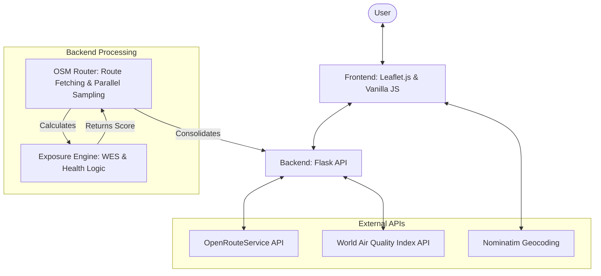

# BreatheEasy+ | Comprehensive Project Overview

## 🌟 Vision
**BreatheEasy+** is a state-of-the-art Health-Aware Navigation System. While traditional GPS systems focus on time and distance, BreatheEasy+ prioritizes the **physiological impact of air pollution** on the user. It is specifically designed for vulnerable groups—asthma patients, pregnant women, the elderly, and children—to help them navigate urban environments with minimal respiratory and cardiovascular risk.

---

## 🏗️ System Architecture

The following diagram illustrates the data flow and component interaction within the system:



---

## 🛠️ Technology Stack

### Backend (Python/Flask)
- **Framework**: `Flask` for lightweight, high-performance API endpoints.
- **Concurrency**: `ThreadPoolExecutor` (Threading) for parallel API fetching, reducing latency by 10x.
- **Mathematical Logic**: Custom Python implementation for exposure metrics.

### Frontend (HTML5/CSS3/JS)
- **Map Library**: `Leaflet.js` for interactive geospatial visualization.
- **Visuals**: Dynamic "Heatmap Polyline" that changes color based on real-time AQI.
- **Geocoding**: `Nominatim` for address-to-coordinate conversion.

### Data & Services
- **Routing**: `OpenRouteService (ORS)` provides detailed polyline data and turn-by-turn instructions.
- **Pollution Data**: `WAQI (World Air Quality Index)` provides real-time PM2.5, PM10, NO2, and Ozone levels from official CPCB stations.

---

## 🧠 Core Algorithms

### 1. Weighted Exposure Score (WES)
The heart of the project is the **WES Formula**. It converts raw pollution data into a health-impact score.

$$WES = \sum (Pollutant_{Conc} \times Sensitivity_{Weight} \times Breathing_{Factor}) \times \frac{Time}{30min}$$

- **Sensitivity Weights**: Adjusted per condition (e.g., Asthma is more sensitive to PM2.5; Heart Disease is more sensitive to NO2).
- **Breathing Factor**: Accounts for physiological differences (e.g., children have a 40% higher breathing rate relative to body weight).
- **Time Factor**: Normalizes exposure based on the duration of the trip.

### 2. Route Recommendation Logic
The system evaluates multiple paths and selects the "Best" route using a **Combined Score**:

$$Score = (\alpha \times Normalized\_WES) + ((1 - \alpha) \times Normalized\_Distance)$$

- **$\alpha$ (Alpha)**: A weighting factor that shifts based on health condition. For vulnerable users, $\alpha$ is high (prioritizing air quality). For normal users, $\alpha$ is lower (balancing time and health).

### 3. Parallel Granular Sampling
Instead of checking air quality once, the system "walks" the route virtually. Every **500 meters**, a sample is taken. These requests are sent in parallel via multi-threading to ensure the UI remains responsive.

---

## 📂 File-by-File Breakdown

### Backend (`/backend`)
- **`app.py`**: The entry point. Hosts endpoints for `/api/route` (route recommendation), `/api/advisory` (safe outdoor time), and `/api/aqi` (real-time point check).
- **`osm_router.py`**: The orchestrator. Fetches routes from ORS, performs parallel AQI sampling, and applies the recommendation logic.
- **`exposure_engine.py`**: The "Math Lab". Contains all sensitivity constants, health reasoning, and the WES calculation functions.
- **`.env`**: Stores sensitive API keys (ORS_KEY, WAQI_TOKEN).

### Frontend (`/frontend`)
- **`directions_demo.html`**: The complete UI. Features a search interface, sidebar for route details, health condition selector, and a premium Leaflet map.
- **`test.js`**: (Utility) Used for testing API connections and responses during development.

---

## 🚀 Setup & Installation

### 1. Prerequisites
- Python 3.8+
- API Keys: [OpenRouteService](https://openrouteservice.org/) and [WAQI Token](https://aqicn.org/api/).

### 2. Backend Setup
```bash
cd backend
python -m venv .venv
source .venv/bin/activate  # Or .venv\Scripts\activate on Windows
pip install -r requirements.txt
# Create .env and add ORS_KEY and WAQI_TOKEN
python app.py
```

### 3. Frontend Setup
Simply open `frontend/directions_demo.html` in any modern web browser. The frontend communicates with the backend on `localhost:5000`.

---

## 📈 Key Features
- **Health Personas**: Select between Asthma, Heart Disease, Pregnant, Elderly, Child, or Normal.
- **Live Heatmap**: View the pollution levels *on the road* as you travel.
- **Smart Advisory**: Get personalized advice like "Air is poor, wear a mask" or "Safe to stay out for 2.5 hours."
- **Bangalore Optimized**: Biased geocoding and regional fallbacks specifically tuned for Bangalore's urban layout.
